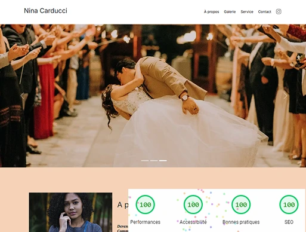

# Projet OC 4 - Nina Carducci

<i>Travail réalisé lors de la formation "Développeur Web" d'OpenClassrooms.<br>Code avant optimisation et débogage sur la branche Starter-code ou disponible [ICI](https://github.com/OpenClassrooms-Student-Center/Nina-Carducci-Dev)</i>


<p align="center">
  
  
</p>


## 🎞️ Scénario
<i>Vous êtes développeur freelance et vous décidez de proposer vos services d’optimisation SEO à de nouveaux clients. Parmi vos prospects, il y a le site de Nina Carducci, une photographe dont vous a parlé l’un de vos amis. Vous envoyez un mail à Nina. Le lendemain, Nina a répondu favorablement à votre demande, et a convenu d’un rendez-vous téléphonique avec vous pour discuter des détails de l’optimisation du site.</i>
<br><br>

## 🎯 Objectifs
- Optimiser les performances d’un site web.
- Débugger un site web grâce aux **Chrome DevTools**.
- Améliorer l'accessibilité pour rendre le site conforme aux standards et accessible à tous les utilisateurs.
- Rédiger un cahier de recette pour tester un site.
<br><br>

## 💡 Technologies utilisées
- HTML5
- CSS3
- JavaScript
- Chrome DevTools 
<br><br>


## 📂 Structure
📁 OC_P4_Optimisation-N_CARDUCCI/ 
│── 📁 assets/ 
│    └── 📁 bootstrap/ 
│    └── 📁 images/
│    └── maugallery.js
│    └── scripts.js
│    └── style.css
│── index.html 
│── README.md
<br><br>

## 🚀 Installation
1. **Cloner** le dépôt GitHub :
   ```bash
   git clone https://github.com/HeleneC-cyber/OC_P4_Optimisation-N-CARDUCCI.git
2. **Naviguer** dans le répertoire du projet :
   ```bash
   cd OC_P4_Optimisation-N-CARDUCCI
3. **Ouvrir** le fichier index.html dans votre navigateur.
<br><br>


## 💻 Démonstration en ligne
👉 Voir le site en ligne [ICI](https://helenec-cyber.github.io/OC_P4_Optimisation-N-CARDUCCI/)
<br><br>

## 📝 Notes additionnelles
- Ce projet permet d'appréhender des notions importantes comme le SEO, l'accessibilité, l'intérêt des balises structurelles, des métadonnées, et les manières d'optimiser les performances, en particulier la gestion des images.
- Le projet offre également l'occasion de comprendre le code d'un autre développeur afin de corriger les bugs et d’appréhender différentes approches de développement.
- Les bonnes pratiques de versionnement avec GitHub ont été respectées.
<br><br>


## 📬 Contact
Pour toute question ou suggestion, n'hésitez pas à me contacter sur [LinkedIn](https://www.linkedin.com/in/helene-canovas-48710b141/)